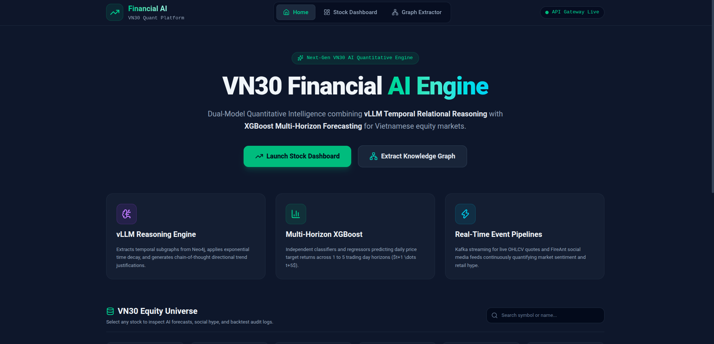
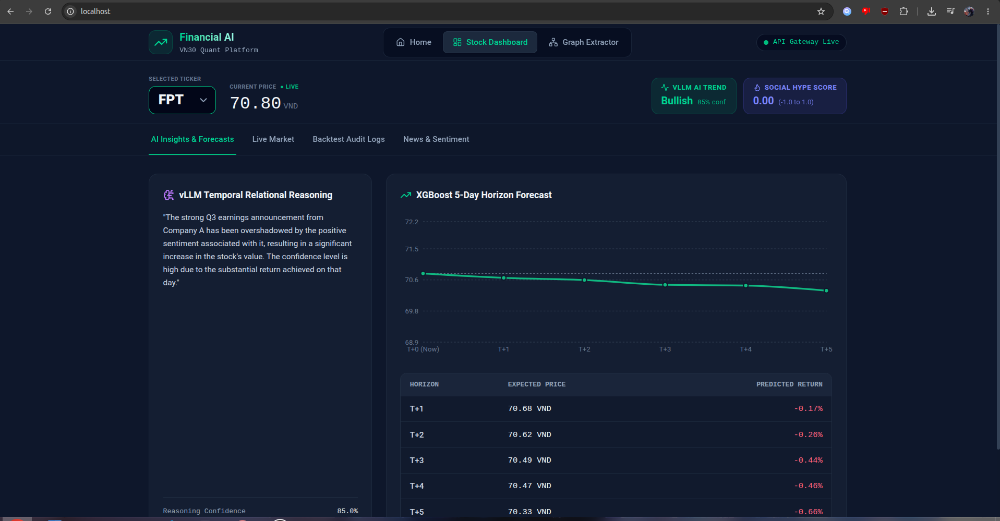
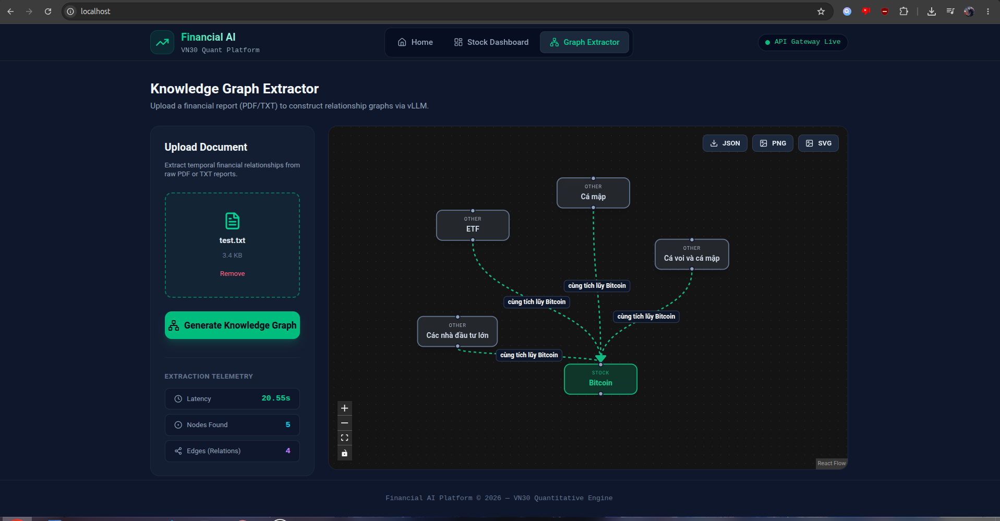

# 📈 Financial AI Platform - VN30 Quantitative Engine

  


## 1. Mô tả dự án

**Financial AI Platform** là hệ thống phân tích định lượng và dự báo thị trường chứng khoán (tập trung vào nhóm VN30), ứng dụng kiến trúc AI Kép.

Hệ thống kết hợp sức mạnh của Mô hình Ngôn ngữ Lớn (**vLLM - Qwen**) để suy luận quan hệ nhân quả theo thời gian (Temporal Relational Reasoning - TRR) từ Đồ thị Tri thức (Knowledge Graph), cùng với thuật toán Học máy **XGBoost** để dự phóng giá trị tài sản đa khung thời gian (Multi-Horizon Forecasting từ T+1 đến T+5).

Toàn bộ hệ thống được xây dựng theo kiến trúc **Event-Driven Microservices**, xử lý luồng dữ liệu thời gian thực qua Apache Kafka, tự động thu thập tin tức, phân tích tâm lý đám đông (Social Sentiment) và truyền tải trực tiếp tới người dùng qua WebSockets.

---

## 2. Tính năng nổi bật

* **Suy luận Đồ thị Tri thức (Knowledge Graph & TRR):** Tự động đọc hiểu báo cáo tài chính (PDF/TXT), trích xuất các thực thể và mối quan hệ tác động (Positive/Negative/Neutral), lưu trữ vào **Neo4j**. Sử dụng vLLM để đưa ra lý giải logic về xu hướng cổ phiếu.
* **Dự phóng Giá Đa khung thời gian (Multi-Horizon Regression):** Mô hình **XGBoost** dự báo tỷ suất sinh lời và mức giá kỳ vọng cho các phiên giao dịch tiếp theo (T+1 đến T+5).
* **Xử lý Dữ liệu Thời gian thực (Real-time Streaming):** Tích hợp dữ liệu thị trường (VNStock) và mạng xã hội (FireAnt) qua **Apache Kafka**, truyền tới Frontend qua **WebSocket**.
* **Chỉ số Tâm lý Đám đông (Social Hype Index):** Lượng hóa cảm xúc và mức độ tương tác (Likes, Shares, Comments) từ cộng đồng để phát hiện sự phân kỳ giữa tâm lý và giá cả.
* **Kiểm định & Đánh giá tự động (Backtest Audit Logs):** Tự động lưu vết các dự báo (Classification & Regression) và đối chiếu với kết quả thực tế của thị trường (T+1) để đánh giá độ chính xác của mô hình.

---

## 3. Công nghệ sử dụng (Tech Stack)

* **Frontend:** React 19, Vite, Tailwind CSS, `@xyflow/react` (vẽ Graph), Recharts, Lucide Icons.
* **Backend / API Gateway:** FastAPI, Python 3.12, AsyncIO, Uvicorn.
* **AI & Machine Learning:** vLLM (Qwen-1.5b), XGBoost, MLflow (MLOps Model Tracking).
* **Data Pipeline & Streaming:** Apache Kafka, Confluent Kafka Python.
* **Databases:**
  * **MongoDB:** Lưu trữ dữ liệu thô và dữ liệu đã xử lý.
  * **Neo4j:** CSDL Đồ thị lưu trữ đồ thị tri thức (Knowledge Graph).
  * **Redis:** Caching cho các truy vấn AI và Session.
* **DevOps & Infrastructure:** Docker, Docker Compose, Nginx.

---

## 4. Demo Hệ thống

* **Link Video Demo Hệ thống:** [Xem Video Demo trên Google Drive](https://drive.google.com/file/d/1Eep7WAoS-I6KL-TrVYUpIoCxZytNIWDY/view?usp=sharing)

  

  

---

## 5. Hướng dẫn cài đặt 

### Yêu cầu hệ thống:
* Docker & Docker Compose
* GPU hỗ trợ CUDA (nếu chạy vLLM Engine ở local) hoặc endpoint vLLM tương thích.

### Các bước triển khai:

**Bước 1: Clone repository**
```bash
git clone https://github.com/your-username/financial-ai-platform.git
cd financial-ai-platform
```

**Bước 2: Cấu hình biến môi trường**  
Tạo file `.env` từ file mẫu `.env.example` và điền các thông số kết nối:
```bash
cp .env.example .env
```

**Bước 3: Khởi chạy toàn bộ hệ thống bằng Docker Compose**  
Lệnh này sẽ tự động build và chạy Frontend, API Gateway, các Microservices cùng hệ sinh thái Database (MongoDB, Neo4j, Redis, Kafka):
```bash
docker compose up -d --build
```

**Bước 4: Truy cập ứng dụng**  
* **Web App (Frontend):** `http://localhost`
* **API Gateway Documentation (Swagger):** `http://localhost:8000/docs`

---

## 📂 6. Cấu trúc Dự án

```text
financial-ai-platform/
├── app/                        # User-facing Applications
│   ├── api/                    # FastAPI Gateway (Routing, Auth, Caching)
│   └── web/                    # React + Vite Frontend (UI, React Flow, WebSockets)
├── modules/                    # Event-driven Backend Microservices
│   ├── acquisition/            # Thu thập dữ liệu VNStock & FireAnt -> Đẩy vào Kafka
│   ├── extraction/             # NLP Engine: Lọc tin tức, tạo Feature Vector & Graph Relations
│   ├── graph/                  # Graph Engine: Canonicalize và ghi dữ liệu vào Neo4j (Cypher)
│   ├── mlops/                  # MLOps: Quản lý vòng đời Model XGBoost (Train, Evaluate, MLflow)
│   └── reasoning/              # Reasoning Engine: Truy vấn Neo4j & gọi vLLM để suy luận chuỗi
├── docker-compose.yml          # Cấu hình triển khai hệ thống lõi
└── docker-compose.llm.yml      # Cấu hình triển khai LLM Engine (vLLM GPU)
```